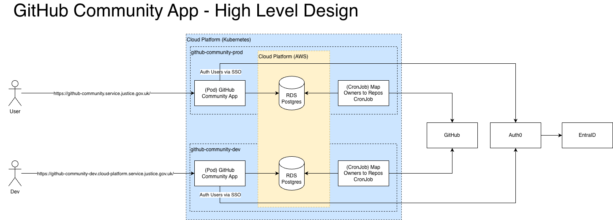
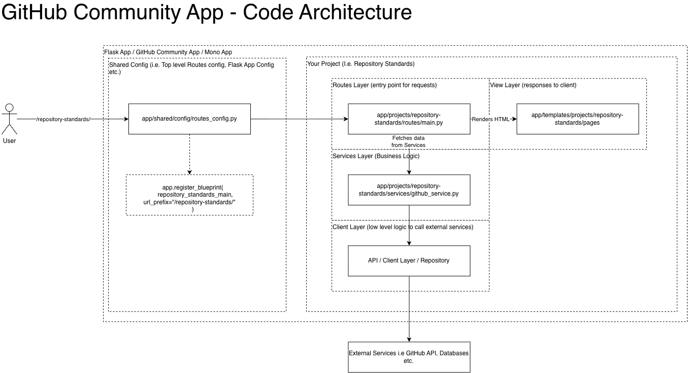
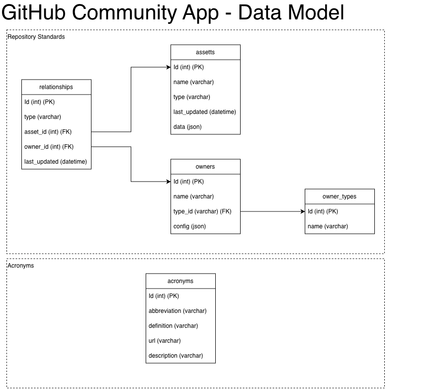
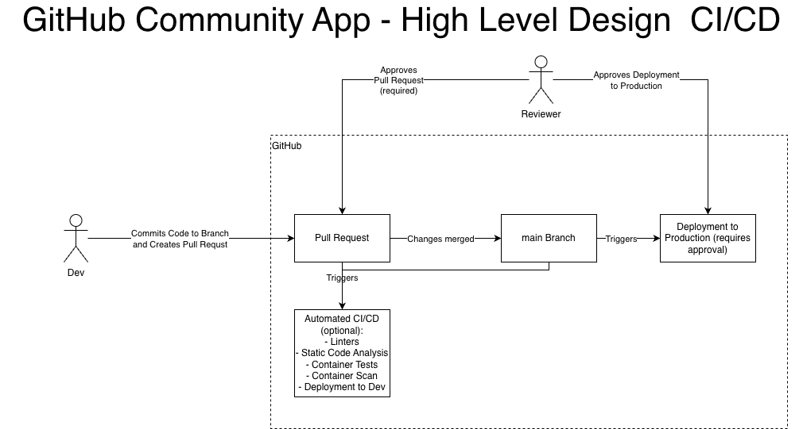
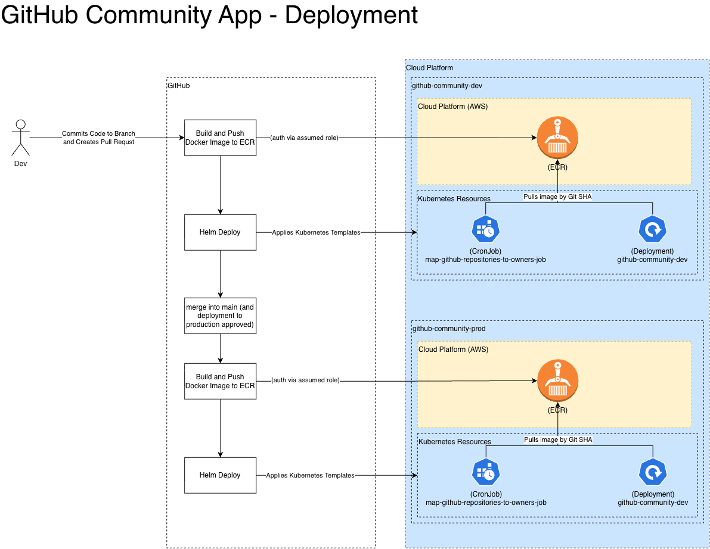

# 🚀 GitHub Community

[](https://github-community.service.justice.gov.uk/repository-standards/github-community) [](https://scorecard.dev/viewer/?uri=github.com/ministryofjustice/github-community)

[](https://vscode.dev/redirect?url=vscode://ms-vscode-remote.remote-containers/cloneInVolume?url=https://github.com/ministryofjustice/github-community) [](https://codespaces.new/ministryofjustice/github-community)

Welcome to the **GitHub Community**! This repository serves as a central hub for community-driven projects within the **Ministry of Justice** GitHub space.

## 📜 Table of Contents

- [📣 About GitHub Community](#-about-github-community)
- [📌 Projects](#-projects)
- [🏗️ github-community Repository](#-github-community-repository)
  - [🔑 Key Features](#-key-features)
  - [📂 Folder Structure](#-folder-structure)
  - [🌎 Hosted Services](#-hosted-services)
  - [✅ Benefits](#-benefits)
  - [❌ Challenges](#-challenges)
  - [🛠️ Development Setup](#-development-setup)
  - [🧭 Repository Standards onboarding](#-repository-standards-onboarding)
    - [Services the application provides](#services-the-application-provides)
    - [Application architecture](#application-architecture)
    - [Code architecture](#code-architecture)
    - [Underlying data model](#underlying-data-model)
    - [CI/CD processes](#cicd-processes)
    - [Deployment process](#deployment-process)
  - [🚀 Managing Deployments and CronJobs](#-managing-deployments-and-cronjobs)
- [📄 License](#-license)

## 📣 About GitHub Community

The **GitHub Community** is a group of passionate engineers dedicated to building great services. It is run by volunteers and promotes an **engineer-first** approach, ensuring that projects remain in the hands of those who actively develop them. The community fosters innovation and collaboration by supporting multiple projects within the **Ministry of Justice** GitHub ecosystem.

## 📌 Projects

The community currently provides the following projects and services:

| Project Name              | Description                                                                                               |
| ------------------------- | --------------------------------------------------------------------------------------------------------- |
| **Repository Standards**  | Improving code quality and security by centralizing knowledge and best practices for GitHub repositories. |
| **Shared GitHub Actions** | Providing reusable GitHub Actions to reduce technical debt, improve maintainability, and enhance quality. |
| **...**                   | More projects to be added...                                                                              |

## 🏗️ github-community Repository

The **github-community repository** serves as the primary hub and a single pane of glass for all things **GitHub Community**. To help engineers quickly build and deploy their projects, this repository hosts a **modular monolithic Flask application**. Engineers can optionally choose to host their ideas here, minimizing maintenance burdens while gaining quick access to shared components.

### 🔑 Key Features

- **Single Flask Application:** A shared core framework hosting multiple projects.
- **Single Set of Dependencies:** Simplified dependency management.
- **Shared Database (Amazon RDS - PostgreSQL):** Minimal maintenance with easy access to data persistence.
- **Shared Authentication:** Quickly secure projects with a common authentication layer.
- **Modular Code Structure:** Projects are self-contained within the monolith.

### 📂 Folder Structure

```
/github-community/
├── app/                      # Core Flask application
│   └── projects/                 # Individual project modules
│       ├── repository_standards/     # Repository standards module
│       ├── shared_github_actions/    # GitHub Actions module
│       └── ...
│   └── shared/                   # Shared modules
│       ├── config/                   # Shared configuration settings
│       ├── middleware/               # Shared middleware functions
│       ├── routes/                   # Shared routes
│       ├── database.py               # Shared database connection
│       └── ...
├── tests/                    # Automated tests
└── ...
```

### 🌎 Hosted Services

This repository provides a set of services accessible at **[github-community.service.justice.gov.uk](https://github-community.service.justice.gov.uk)**, including:

- **✅ Repository Standards** – Automated reports on repository health and best practices.

### ✅ Benefits

- **Simplified Maintenance** – One codebase to manage.
- **Shared Components** – Reduces duplication of common functionality.
- **Easier Collaboration** – Community contributions are streamlined.
- **Scalable & Extensible** – New projects can be added with minimal setup.

### ❌ Challenges

- **Coupling** – Projects share infrastructure and dependencies.
- **Deployment Coordination** – Updates affect all projects simultaneously.
- **Performance Considerations** – Shared resources must be optimized.

### 🛠️ Development Setup

### Prerequisites

- [uv](https://docs.astral.sh/uv/)
- Docker (optional for local database setup)

### Setup Instructions

```sh
# Clone the repository
git clone https://github.com/ministryofjustice/github-community.git

cd github-community

# Install dependencies
make uv-activate

# Run the application
make app-start
```

### 🧭 Repository Standards onboarding

Repository Standards helps teams track repository health across licensing,
security, and governance checks. This section is designed for fast onboarding.

#### Services the application provides

Repository Standards provides:

- report views for all repositories, teams, business units, and unowned repos
- repository-level compliance reports with maturity levels and checks
- badge API endpoints under `/repository-standards/api/<repository>/badge`
- backwards-compatible legacy endpoints under deprecated routes

#### Application architecture



At a high level:

- Repository Standards is part of the Flask modular monolith application.
- The app is deployed into the Cloud Platform Kubernetes cluster.
- The app integrates with AWS RDS hosted via Cloud Platform for persistence.
- A scheduled CronJob queries GitHub for repository data and stores it in RDS.
- The app integrates with Auth0 and Entra ID for SSO authentication.

#### Code architecture



`app/projects/repository_standards/` follows a layered pattern:

- **routes/** exposes UI pages, APIs, and deprecated compatibility routes
- **services/** contains compliance, GitHub, and relationship business logic
- **repositories/** handles persistence access for assets and owners
- **models/** defines compliance and repository view models
- **jobs/** contains scheduled worker entrypoints
- **clients/** contains low level integration details for external services

#### Underlying data model



Repository Standards stores repository snapshots and ownership mappings in four
main tables:

- **assets**: one row per repository (`type=REPOSITORY`) plus JSON repository
  metadata in `data`
- **owners**: owner entities (for example business units and teams), with
  owner-specific config in JSON
- **owner_types**: lookup table for owner categories (for example `TEAM`,
  `BUSINESS_UNIT`)
- **relationships**: many-to-many links between `assets` and `owners`, with a
  relationship type such as `ADMIN_ACCESS` or `OTHER`

The mapper job refreshes repository and relationship data, and stale records
are removed during cleanup.

#### CI/CD processes



PR commits trigger automated checks and a development deployment. Checks
include linting, tests, security scanning, and image/container checks via the
workflows in `.github/workflows/`.

PRs must be reviewed before merge to `main` under branch protection rules.

When code is merged to `main`, push-triggered workflows run and deployment
pipelines start, including production deployment. Production is gated by manual
approval through GitHub Environment protection rules.

#### Deployment process



Deployments are Helm-driven using `helm/github-community/`, with separate
`values-dev.yaml` and `values-prod.yaml` configuration.

Images are built in GitHub Actions and pushed to AWS ECR. The workflows
authenticate to AWS using `aws-actions/configure-aws-credentials`, then log in
to ECR before build/push.

Deployment to Cloud Platform authenticates using Kubernetes cert/token secrets
in GitHub Actions, then applies Helm upgrades.

Key Kubernetes resources deployed by the chart:

- **Deployment** (`templates/deployment.yaml`) for the Flask app pods
- **CronJob**
  (`templates/map-github-repositories-to-owners-job.yaml`) for repository-owner
  mapping
- **Ingress** (`templates/ingress.yaml`) for external routing and host mapping

The mapper schedule differs by environment: daily in dev and multiple runs per
day in prod.

### 🚀 Managing Deployments and CronJobs

Occasionally, you may need to debug a failed deployment or failing CronJob in
the Cloud Platform Kubernetes cluster. Replace `github-community-dev` with the
namespace you are working in.

Before trying these commands, follow the
[Cloud Platform cluster connection guide][cluster-guide].

Get pods in the namespace. This helps you check pod health and identify failing
pods:

```bash
$ kubectl -n github-community-dev get pods
NAME                       READY   STATUS      AGE
github-community-abc123    1/1     Running     27h
mapper-job-123             0/1     Completed   104m
```

Get logs from a specific pod. This helps explain why a pod may fail to start:

```bash
$ kubectl -n github-community-dev logs github-community-abc123
2026-08-14T13:36:31 | INFO | error_handler.py:14 | 404 Not Found request
```

Get CronJobs to see what exists and confirm names for other commands:

```bash
$ kubectl -n github-community-dev get cronjobs
NAME         SCHEDULE   SUSPEND   ACTIVE   LAST SCHEDULE   AGE
mapper-job   0 3 * * *  False     0        10h             508d
```

Create Jobs to manually trigger the mapper job while debugging fixes:

```bash
$ kubectl -n github-community-dev create job manual-mapper-job \
    --from cronjob/map-github-repositories-to-owners-job
job.batch/manual-mapper-job created
```

Get Jobs to inspect running and previous executions:

```bash
$ kubectl -n github-community-dev get jobs
NAME             STATUS      COMPLETIONS   DURATION   AGE
manual-mapper    Running     0/1                      25s
mapper-job-a     Failed      0/1           122d       122d
mapper-job-b     Failed      0/1           121d       121d
mapper-job-c     Complete    1/1           52m        10h
```

[cluster-guide]: https://user-guide.cloud-platform.service.justice.gov.uk/documentation/getting-started/kubectl-config.html

---

## 📄 License

This project is licensed under the **MIT License**.
See the [LICENSE](LICENSE) file for details.
